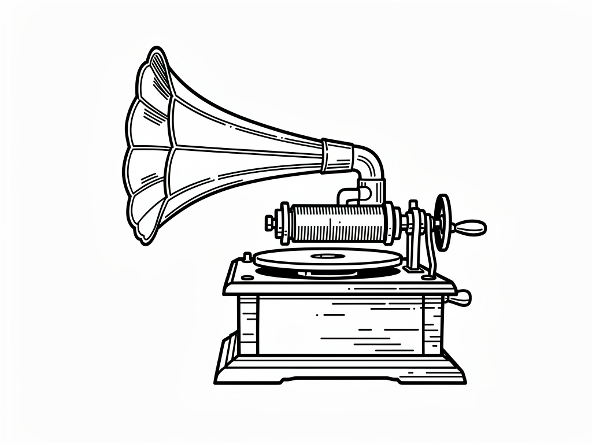

# audiobox

audiobox is a go module that for managing audio metadata in an SQLite3 database. It uses "https://github.com/dhowden/tag" module to extract metadata that may be found in the audio file itself.

This software is for Lourdes.

## Release Notes

- version: 0.0.2
- status: concept
- released: 2026-05-02

- Web UI will initialize on first run
- TUI display bugs fixed

### Authors

- Doiel, R. S.

## Software Requirements

- Go >= 1.26.2

### Software Suggestions

- CMTools >= 0.0.40
- Pandoc >= 3.1
- GNU Make >= 3
- Deno >= 2.4.0
- FFmpeg >= 6.0

## Related resources

- [Getting Help, Reporting bugs](https://github.com/rsdoiel/audiobox/issues)
- [LICENSE](https://www.gnu.org/licenses/agpl-3.0.txt)
- [Installation](INSTALL.md)
- [About](about.md)

